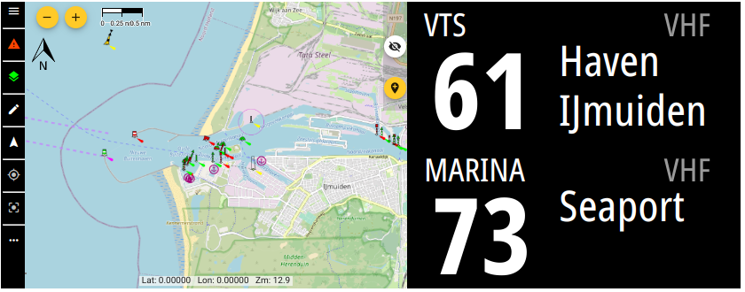

# VHFinfo
VHF channel information based on GeoJSON data. Plugin for SignalK included.

## Purpose
While sailing you're often expected to listen out certain VHF channels. Most of them can be found on the electronic maps, but not always in a handy way. And it requires you to know you have to look for it in advance.

By collection the VHF channel info together with coordinate information it's easy to display relevant information in the cockpit.



## Format used
The information is collected as [GeoJSON](https://geojson.org/) which holds both coordinates and properties.

## Viewing information
To see if certain VHF information is already present, you can use only of the following country links to see the data plotted on a map.

[NLD](https://geojson.io/#data=data:text/x-url,https://raw.githubusercontent.com/htool/vhfinfo/main/data/NLD.json&map=2/0/20)

## Adding information
To add information you'll have to
- Draw the coordinates on the map
- Add properties according to the properties template
- Create a change proposal to a country file

### Drawing the coordinates on the map
Goto [GeoJSON.io](https://geojson.io/) and draw the VHF channel area as a polygon.
For different types there are different instructions for drawing:

#### Lock
Only draw the full locks chambers (typically rectangles). It's OK to cross over land for multiple chambers
#### Bridge
Only draw under the bridge, fully from side to side (typically rectangles)
#### Marina
Free figure polygon that covers only the (land and water if that's simpler) marina
#### VTS
Here it is important to cover the documented coordinates of the VTS as close as possible, so likely a polygon. In case of half circles on sea towards a port, it's ok to make it less detailed to reduce points)

### Add properties according to the properties template
Use the following template to populate the properties part on the right in the [GeoJSON.io](https://geojson.io/) interface. Either copy the template in, or type over what you need. It's important to stick to the format.

### Properties template
```
      "properties": {
        "name": "",           // Full name
        "callname": "",       // Short name typically used in call
        "type": "",           // ['lock','bridge','marina','vts','territorial']
        "vhfdata": {
          "generic": {
            "channel": ,      // VHF channel number
            "mode": "listen"  // Radio engagement level for this AIS ship/group type
                              // 'listen':    Listen out the channel for any calls or information
                              // 'announce':  Announce you are entering/leaving the area, or intend to pass bridge/lock
                              // 'report':    More than announce, as certain info is expected. See 'note' for details
            "url": "",        // URL with generic info like opening hours, approach guide etc. or in case of non-generic purpose
            "phone": ""       // Phone number in E.164 formatting
          }
          "pleasure": {       // AIS ship/group type as string. (https://coast.noaa.gov/data/marinecadastre/ais/VesselTypeCodes2018.pdf)
            "url":  ""        // URL aimed at pleasure ships
          },
          "passenger": {
            "note": ""        // Note aimed at passenger ships
          },
          "fishing": {
            "mode": "announce"  // Overwrites mode for fishing ships
          },
          "cargo": {
            "mode": "report",
            "note": "",         // Extra details on what to report
            "url":  ""          // URL aimed at cargo ships
          },
          "update": {               // Update bulletin (eg weather) in this VHF area
            "channel": ,            // Channel used
            "time": "5 5,11,17,23"  // weather bulletin at 5h05, 11h05, 17h05 and 23h05 (cron format)
          },
          "emergency": {
            "url":                  // Information for emergencies in this area
            "phone": ""             // Emergency phone number
          }
        }
      }
    }
```

### Create a change proposal to a country file
- A GitHub account is needed for this part
- Go to the [VHFinfo GitHub repository](https://github.com/htool/vhfinfo/data/) and select the country file you want to add your data to, e.g. [NLD](https://github.com/htool/vhfinfo/blob/main/data/NLD.json).
- Press 'E' or use the pencil button on the top right of the file to start editing the file. Now copy-paste the `feature` part of the JSON from the [GeoJSON.io](https://geojson.io/) website into the GitHub editor.
- Add a `,` to the last `}` of the previous feature if needed.
- At the bottom click `submit proposal`

### Editing existing information
- A GitHub account is needed for this part
- Go to the [VHFinfo GitHub repository](https://github.com/htool/vhfinfo/data/) and select the country file you want to edit, e.g. [NLD](https://github.com/htool/vhfinfo/blob/main/data/NLD.json).
- Press 'E' or use the pencil button on the top right of the file to start editing the file.
- Make your changes
- At the bottom click `submit proposal`


## Plugins
Plugins can be create separate from this repository and just use VHFinfo as database. Listing them here could make them easier to find.

### SignalK
The plugin lets you configure the search 'beam' by specifying the length and angle as well as the SignalK path to write to.
The plugin flow is as follows:
 1. Determine own location using `navigation.position`
 2. Draw a boundry box around the location with 100Nm (configurable) ribs
 3. Use countries_bbox.json to create bboxes and check if they intersect with the locationBox from step 2
 4. Read features from intersecting to see which intersect with locationBox from 2 and keep them in memory (featuresInBox)
 5. Use heading and location to crete a searchPolygon 'beam' using the plugin config parameters
 6. Go through the features in featuresInBox and check if they intersect with searchPolygon
 7. Use result of 6 to calculate distance to each feature and sort by distance (negative distance means your located inside the feature)
 8. /plugin/vhfinfo/nearby can be called to pull the whole result set of 7.
 9. Write the nearest POI and VTS to the path configured in the plugin

#### API
The resulting nearby VHF info objects array can be queried here:
```
/plugins/vhfinfo/nearby
```

#### SignalK path
You can configure where the plugin writes the two nearest Point of Interest (lock, bridge, marina) and VTS (Vessel Traffic Service). This can be used together with the [SignalK Instrument Display Plugin](https://www.npmjs.com/package/signalk-instrument-display-plugin) to display current VHF info on any display.
